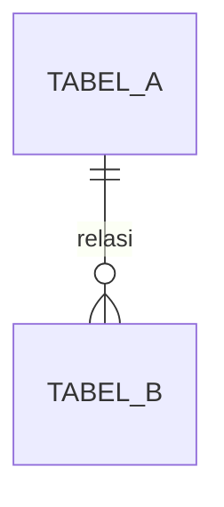

# Feature Documentation Generator

Skill ini untuk mendokumentasikan fitur aplikasi existing (biasanya legacy/tanpa dokumentasi) dengan cara reverse-engineering dari database, kode, dan UI — bukan menulis dokumen fitur baru dari requirement.

## Alur kerja (jalankan berurutan, konfirmasi ke user sebelum lanjut ke tahap berikutnya)

### 1. Inventory dulu — jangan langsung nulis dokumen detail

Sebelum menulis satu pun dokumen fitur, buat inventory level tinggi:

- Scan struktur project (routes/controllers, halaman/menu frontend, daftar tabel database)
- Susun tabel: Nama fitur/modul | Sumber (route/tabel/menu) | Status (aktif/deprecated/tidak jelas) | Estimasi kompleksitas (simple/medium/complex)
- Tampilkan tabel ini ke user dan **minta konfirmasi prioritas** sebelum menulis dokumen detail satu-satu. Jangan asumsikan urutan sendiri untuk project besar.

### 2. Tentukan level dokumentasi per fitur

- **Simple** (tidak mengubah struktur data, logic sederhana): pakai **Lite Template**
- **Medium/Complex** (menyentuh tabel database, banyak business rule, atau butuh audit trail): pakai **Full Template**

Jangan paksa semua fitur pakai Full Template — itu bikin proyek dokumentasi mandek di tengah jalan.

### 3. Reverse-engineering — sumber dan urutan pengecekan

Untuk tiap fitur, gali informasi dengan urutan ini (cross-check ketiganya, jangan andalkan satu sumber saja):

1. **Database**: tabel yang dipakai fitur ini, relasi (FK), kolom penting, constraint. Ini sumber paling objektif untuk "apa yang disimpan".
2. **Kode**: controller/service/endpoint terkait — untuk tahu "apa yang dilakukan sistem" (validasi, business rule, side effect seperti kirim notifikasi/log audit).
3. **UI**: halaman/menu terkait — untuk tahu "apa yang dilihat/dilakukan user", termasuk flow multi-step.

Kalau ada ketidaksesuaian antar sumber (misal kode punya logic yang gak kelihatan di UI), catat sebagai temuan terpisah, jangan ditebak-tebak — tanyakan ke user.

### 4. Struktur folder output

```
docs/
  00-overview.md
  01-database/
    erd.md
    schema-reference.md
  02-features/
    <nama-fitur>.md
  03-glossary.md
```

### 5. Tulis dokumen menggunakan template di bawah

Setelah user konfirmasi prioritas, tulis dokumen satu per satu. Setelah selesai draft tiap dokumen, tampilkan ringkasan (bukan seluruh isi ulang) dan tanyakan apakah lanjut ke fitur berikutnya atau ada koreksi dulu.

---

## Lite Template (fitur simple)

```markdown
# [Nama Fitur]

**Status:** aktif / deprecated | **Kompleksitas:** simple

## Overview

[2-3 kalimat: apa fiturnya, masalah apa yang diselesaikan]

## Scope

- In: ...
- Out: ...

## Functional Requirements

1. ...
2. ...

## Acceptance Criteria

- [ ] ...
```

## Full Template (fitur medium/complex)

````markdown
# [Nama Fitur]

**Status:** aktif / deprecated | **Kompleksitas:** complex
**Sumber:** [route/controller], [tabel database], [halaman UI]

## 1. Overview

[Apa fiturnya, problem statement, goal]

## 2. Background & Context

[Kenapa fitur ini ada, temuan dari kode/histori jika relevan]

## 3. Scope

- In scope: ...
- Out of scope: ...

## 4. User Stories

- Sebagai [role], saya ingin [aksi], sehingga [manfaat]

## 5. Functional Requirements

| #   | Requirement | Catatan/Edge case |
| --- | ----------- | ----------------- |
| 1   | ...         | ...               |

## 6. Non-Functional Requirements

[Performa, security, audit trail — isi jika relevan]

## 7. Database Schema

### Tabel terkait

| Tabel | Kolom | Tipe | Nullable | Keterangan |
| ----- | ----- | ---- | -------- | ---------- |
| ...   | ...   | ...  | ...      | ...        |

### ERD (mermaid)


````

## 8. UI/Flow

[Deskripsi flow atau link ke halaman terkait]

## 9. Technical Notes

[Dependency ke sistem lain, side effect, business rule khusus di kode]

## 10. Testing & Acceptance Criteria

- [ ] ...

## 11. Open Questions / Temuan

[Ketidaksesuaian antar sumber, hal yang perlu dikonfirmasi ke stakeholder]

```

---

## Panduan ERD

- Gunakan format **mermaid `erDiagram`** (renderable langsung di banyak markdown viewer termasuk GitHub) sebagai default.
- ERD di dokumen fitur cukup **scoped ke tabel yang relevan** untuk fitur itu — bukan seluruh database. ERD full database taruh terpisah di `01-database/erd.md`.
- Jangan sertakan full DDL (`CREATE TABLE`) di dokumen — DDL gampang basi. Cukup nama kolom, tipe, nullable, dan keterangan singkat. DDL biarkan hidup di migration script/repo.
- Kalau database besar (puluhan/ratusan tabel), generate `01-database/erd.md` sebagai overview relasi antar modul dulu (level tinggi), baru per-fitur ERD di-scope ke tabel terkait saja.

## Yang harus dikonfirmasi ke user sebelum eksekusi
- Sebelum scan seluruh codebase/database (bisa berat untuk project besar), konfirmasi scope: mau semua modul atau mulai dari yang prioritas dulu.
- Sebelum overwrite dokumen yang sudah ada di folder `docs/`.
- Kalau perlu koneksi ke database untuk introspect schema (bukan cuma baca kode), konfirmasi dulu cara aksesnya (credentials, read-only, dsb).
```
