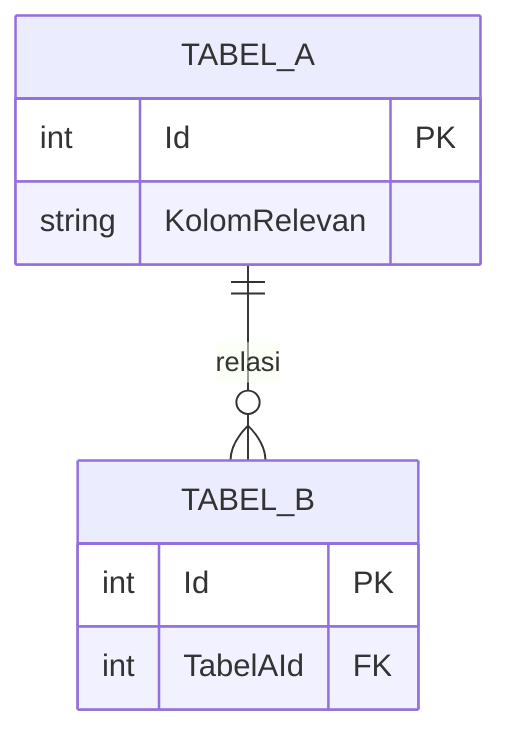
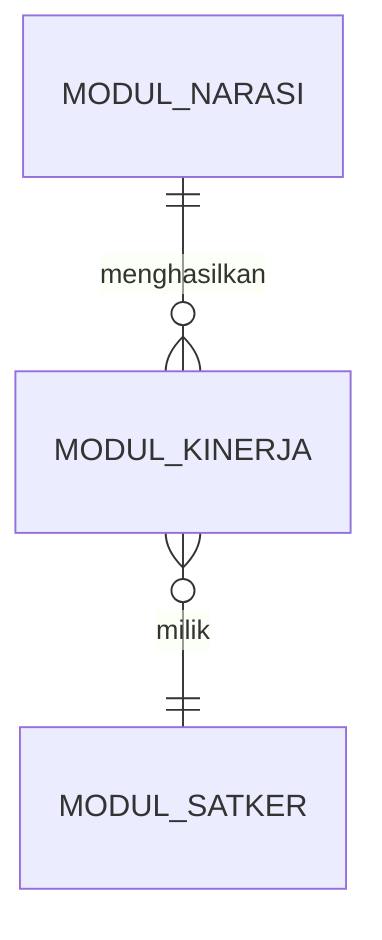

# Templates

## Lite Template

Untuk fitur yang tidak menyentuh tabel database sendiri (murni UI/kalkulasi/orkestrasi).

```markdown
# <Nama Fitur>

## Overview
Satu-dua paragraf: fitur ini apa, dipakai untuk apa, siapa user-nya (role apa yang bisa akses).

## Scope
- In scope: ...
- Out of scope: ...

## Functional Requirements
- FR1: ...
- FR2: ...

## Acceptance Criteria
- Given ... When ... Then ...
```

## Full Template

Untuk fitur medium/complex yang menyentuh tabel database atau butuh audit trail.

```markdown
# <Nama Fitur>

## Overview
Satu-dua paragraf: fitur ini apa, dipakai untuk apa, siapa user-nya.

## Background & Context
Kenapa fitur ini ada (kalau bisa ditelusuri dari kode/komentar/nama modul), posisinya dalam
alur bisnis SIIHPS yang lebih besar.

## Scope
- In scope: ...
- Out of scope: ...

## User Stories
- Sebagai <role>, saya ingin <aksi>, supaya <tujuan>.

## Functional Requirements

| ID | Requirement | Sumber (file:baris) |
|---|---|---|
| FR1 | ... | Controllers/Narasi/KinerjaController.cs:42 |

## Non-Functional Requirements
Performa, batasan akses (role/menu gating), audit trail, dll — hanya yang benar-benar
teramati dari kode, bukan asumsi umum.

## Database Schema

Scoped ke tabel yang relevan dengan fitur ini saja — jangan full DDL, karena gampang basi begitu
ada migration baru. Sertakan kolom yang benar-benar dipakai fitur ini, bukan semua kolom tabel.

| Tabel | Kolom relevan | Tipe | Keterangan |
|---|---|---|---|



## UI/Flow
Langkah pemakaian dari sudut pandang user: menu → form/field → aksi. Sertakan role/menu
gating (CanView/CanEdit/CanDelete) kalau ada.

## Technical Notes
Hal teknis yang perlu diketahui developer lain: endpoint yang dipanggil, pola yang diikuti
(mis. `HTTPWebRequestRepository<T>` + `TypeUrl`), dependency ke modul/service lain.

## Testing & Acceptance Criteria
- Given ... When ... Then ...

## Open Questions/Temuan
Ketidaksesuaian antara database/kode/UI yang ditemukan saat reverse-engineering — jangan
ditebak, catat di sini untuk dikonfirmasi ke user/PO.
```

## ERD Overview Format (docs/01-database/erd.md)

Untuk ERD lintas modul dengan banyak tabel, jangan tampilkan semua kolom — cukup level
relasi antar entitas utama per modul:



Detail kolom per tabel taruh di `docs/01-database/schema-reference.md`, dikelompokkan per
fitur yang sudah didokumentasikan di `docs/02-features/` (bukan didaftar ulang di sini).
